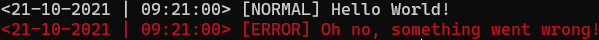

# <b><u>log.py</u></b>
[](https://www.python.org/downloads/release/python-3100/)
[](https://pypi.org/project/log.py/)
[](https://github.com/SebastiaanBij/log.py/blob/main/LICENSE)

## <b>📖 About:</b>
A basic logging library for Python with the capability to:
- save to files.
- have custom formats.
- have custom levels.
- be used instantiated.
- be used non-instantiated.

## <b>📝 Basic Usage:</b>
<i>(For more advanced uses, please refer to the given examples or the documentation.)</i>
### <u>Instantiated:</u>
- Code:
```python
from logpy import Logger
from logpy.log import Levels

logger = Logger()
logger.log("Hello World!")
logger.log("Oh no, something went wrong!", Levels.error)
```

- Terminal:\


### <u>Non-instantiated:</u>
- Code:
```python
from logpy import Logger
from logpy.log import Levels

Logger.slog("Hello World!")
Logger.slog("Oh no, something went wrong!", Levels.error)
```

- Terminal:\


## <b>🔧 Examples:</b>
[Click me!](https://github.com/SebastiaanBij/log.py/tree/main/examples)

## <b>📚 Documentation:</b>
[Click me!](https://sebastiaanbij.github.io/log.py/logpy.html)

## <b>❗ Requirements:</b>
- [Python 3.10](https://www.python.org/downloads/release/python-3100/)
